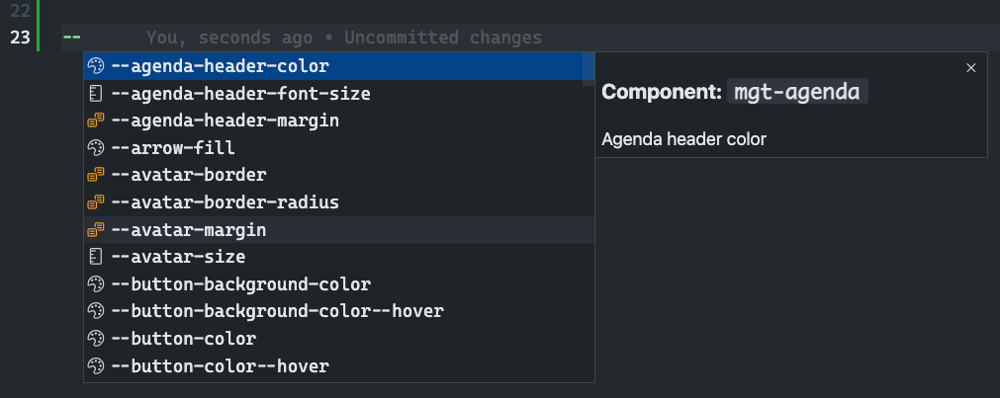

<p align="center">
  <a href="https://marketplace.visualstudio.com/items?itemName=eliostruyf.vscode-msgraph-autocomplete">
    
  </a>
</p>

<h1 align="center">Microsoft Graph Essentials - Visual Studio Code Extension</h1>

<p align="center">
  <a href="https://marketplace.visualstudio.com/items?itemName=eliostruyf.vscode-msgraph-essentials" title="Check it out on the Visual Studio Marketplace">
    
  </a>

  
  
  
</p>

The Microsoft Graph Essentials extension helps you developing with the Microsoft Graph Toolkit & API.

## Autocompletion for CSS variabls

The extension gives you autocompletion for all the CSS variables which are used to customize the styling of the MGT web components.

Example:

```CSS
mgt-person {
  --person-card-display-name-font-size: 40px;
  --person-card-display-name-color: #ffffff;
  --person-card-title-font-size: 20px;
}
```

Using is as simple as starting to type `--`, and the extension will show you all the options.



## Snippets

### React

| Snippet | Purpose |
|---------|---------|
| `mgt-react-tmp` | Create a new MGT React template component. |

### HTML

Snippets to insert the MGT web component in HTML:

| Snippet |
|---------|
| `mgt-agenda` |
| `mgt-login` |
| `mgt-people` |
| `mgt-people-picker` |
| `mgt-person` |
| `mgt-person-card` |
| `mgt-tasks` |
| `mgt-teams-channel-picker` |

### CSS

Snippets to quickly modify the component styles:

| Snippet |
|---------|
| `mgt-agenda` |
| `mgt-login` |
| `mgt-people` |
| `mgt-people-picker` |
| `mgt-person` |
| `mgt-person-card` |
| `mgt-tasks` |
| `mgt-teams-channel-picker` |

## Changelog

See the [changelog](./CHANGELOG.md) for the latest changes.

## Feedback and snippet ideas

Feedback and/or ideas are always welcome. Please submit them via creating an issue in the extension repository: [issue list](https://github.com/estruyf/vscode-msgraph-essentials/issues).

<p align="center">
  <a href="#">
      
   </a>
</p>